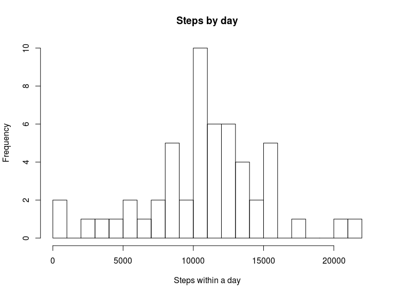
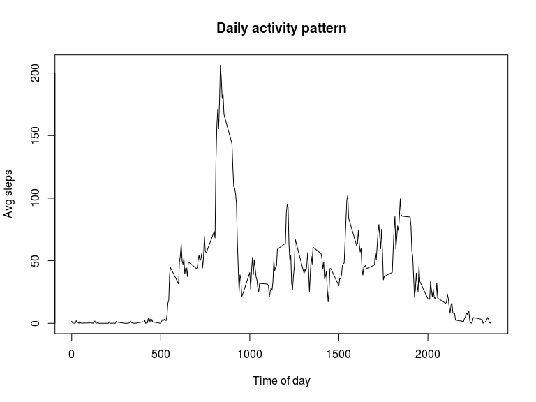
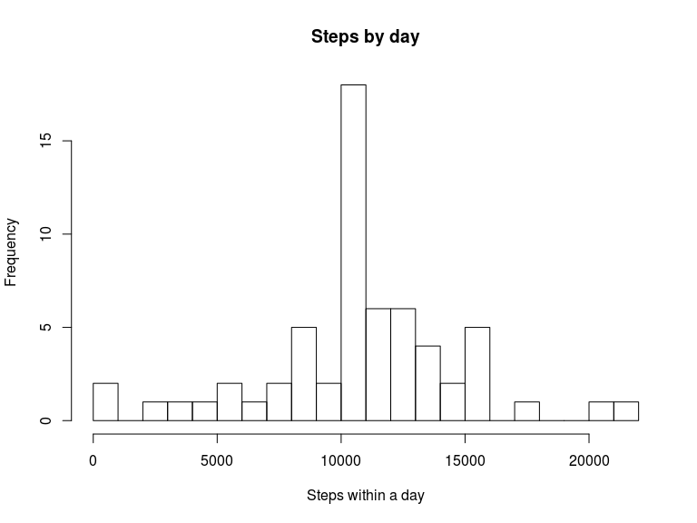
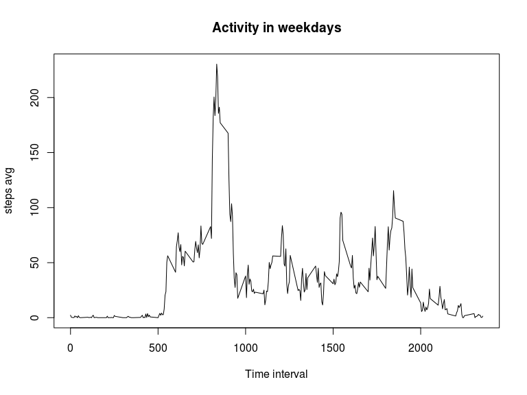
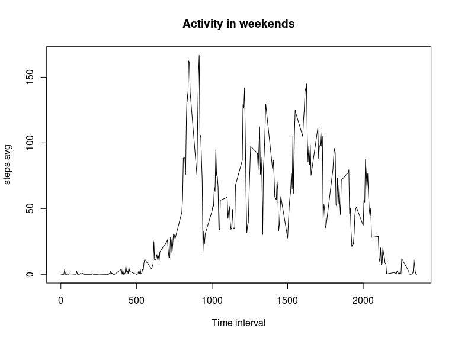

# Reproducible Research: Peer Assessment 1


## Loading and preprocessing the data

```r
library("dplyr")
```

```
## 
## Attaching package: 'dplyr'
## 
## The following object is masked from 'package:stats':
## 
##     filter
## 
## The following objects are masked from 'package:base':
## 
##     intersect, setdiff, setequal, union
```

```r
unzip("activity.zip")
acData <- read.csv("activity.csv")
```


## What is mean total number of steps taken per day?


```r
  # calculates the total number of steps taken per day
  g <- group_by(acData, date)
  stepsByDay <- summarize(g, steps = sum(steps) )

  # and then plots a histogram
  hist(stepsByDay$steps, breaks=20, main="Steps by day", xlab="Steps within a day", ylab="Frequency")
```

 

Calculating the daily mean steps taken:

```r
  mean(stepsByDay$steps, na.rm=T)
```

```
## [1] 10766.19
```

Calculating the daily median steps taken:

```r
  median(stepsByDay$steps, na.rm=T)
```

```
## [1] 10765
```

## What is the average daily activity pattern?

Below is shown a plot of the number of steps taken during the day averaged all long the interval of two months.


```r
  g <- group_by(acData, interval)
  stepByInterval <- summarise(g, avgSteps=mean(steps, na.rm=T))
```


```r
  plot(stepByInterval$interval, stepByInterval$avgSteps, type="l", xlab="Time of day", ylab="Avg steps", main="Daily activity pattern")
```

 

The most active time of the day is (as can be seen in the above plot ) is


```r
  arrange(stepByInterval, desc(avgSteps))[1,]
```

```
## Source: local data frame [1 x 2]
## 
##   interval avgSteps
## 1      835 206.1698
```


## Imputing missing values

Counting the missing values over the observations:


```r
  naObs <- filter(acData,is.na(steps))

  nrow(naObs)
```

```
## [1] 2304
```


For filling the missing values we are replacing the gaps by the previously calculated mean over the time intervals (```stepByInterval```)


```r
  # merge NAs with the averaged values
  merged <- merge(naObs, stepByInterval, by_x=interval, by_y=interval, all=T)

  # replace NAs
  merged <- mutate(merged, steps=avgSteps)
  naReplacement <- select(merged, -avgSteps)

  # build the new dataset
  newAcData <- filter(acData,!is.na(steps))
  newAcData <- rbind(newAcData, naReplacement)
  newAcData <- distinct(newAcData, interval, date)
```


```r
  # calculates the total number of steps taken per day
  g <- group_by(newAcData, date)
  stepsByDay <- summarize(g, steps = sum(steps) )

  # and then plots a histogram
  hist(stepsByDay$steps, breaks=20, main="Steps by day", xlab="Steps within a day", ylab="Frequency")
```

 


Calculating the daily mean steps taken:

```r
  mean(stepsByDay$steps, na.rm=T)
```

```
## [1] 10766.19
```

Calculating the daily median steps taken:

```r
  median(stepsByDay$steps, na.rm=T)
```

```
## [1] 10766.19
```

In this case we find a small diffence comparing in these stimators comparing the previously calculated ones.

## Are there differences in activity patterns between weekdays and weekends?

Now we are adding two new columns which tells whether it's a weekday or a day in a weekend.


```r
  # Adds the new column
  newAcData <- mutate(newAcData, date=as.POSIXct(date))

  weekAcData <- mutate(newAcData, weekday=as.factor( ifelse((weekdays(date,abbreviate=T)=='Dom' | weekdays(date,abbreviate=T)=="Sáb"), F, T) ) )


  # summarize by interval
  g <- group_by(weekAcData, weekday, interval)
  stepByInterval <- summarise(g, avgSteps=mean(steps, na.rm=T))
```

Checkout out the weekday activity:


```r
  actv = filter(stepByInterval, weekday==T)
  plot(actv$interval, actv$avgSteps, type="l", main="Activity in weekdays", xlab="Time interval", ylab="steps avg")
```

 


Checkout out the weekend activity:


```r
  actv = filter(stepByInterval, weekday==F)
  plot(actv$interval, actv$avgSteps, type="l", main="Activity in weekends", xlab="Time interval", ylab="steps avg")
```

 


